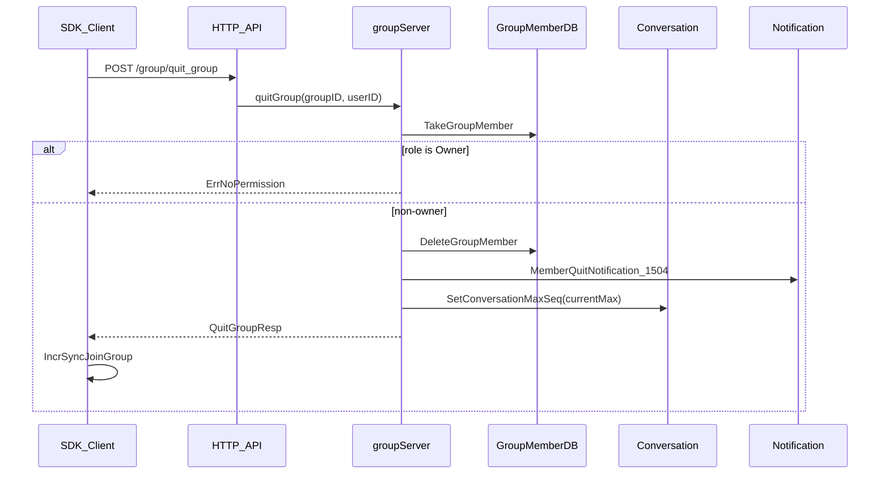

# OpenIM 退出群聊（QuitGroup）实现说明

> 参考文档：梳理 OpenIM QuitGroup 端到端实现，供后续对齐 SuIM 使用。  
> 本文不包含 SuIM 改动；对齐实现需另开计划。

## 结论

OpenIM 退群 = **删成员关系 + 保留会话并冻结 `max_seq`**。  
**不会**把群状态改成解散（`GroupStatusDismissed`）；解散是另一条接口 `DismissGroup`。

## 调用链



## 1. 协议与入口

| 层 | 位置 | 内容 |
|---|---|---|
| Proto | `OpenIM/protocol/group/group.proto` | `QuitGroupReq{ groupID, userID }` / 空 `QuitGroupResp`；RPC `quitGroup` |
| HTTP | `POST /group/quit_group` | 路由到 `GroupApi.QuitGroup` |
| SDK REST | `OpenIM/openim-sdk-core/pkg/api/api.go` | 同上路径 |

`userID` 可空：空则用当前操作用户；非空则走 `CheckAccess`。

## 2. 服务端核心逻辑

文件：`OpenIM/internal/rpc/group/group.go` — `groupServer.QuitGroup`（约 1002–1031 行）

按顺序：

1. 解析退群用户（默认 `opUserID`）
2. `TakeGroupMember` — 必须是成员，否则失败
3. **群主校验**：`RoleLevel == GroupOwner` → `ErrNoPermission`（`"group owner can't quit"`）
4. `DeleteGroupMember` — 从 `group_members` 删除，并 bump 成员版本 / 加入群版本、清缓存
5. `MemberQuitNotification` — 向群会话广播 1504
6. `deleteMemberAndSetConversationSeq` — **不删会话**，只设退群者的 `max_seq`
7. 可选 webhook `afterQuitGroup`

群主要离开只能：先 `transferGroupOwner` 再 `QuitGroup`，或直接 `DismissGroup`。

## 3. 会话为什么不删

`deleteMemberAndSetConversationSeq`：

```go
conversationID := GetConversationIDBySessionType(ReadGroupChatType, groupID)
maxSeq := msgClient.GetConversationMaxSeq(conversationID)
conversationClient.SetConversationMaxSeq(conversationID, userIDs, maxSeq)
```

`OpenIM/internal/rpc/conversation/conversation.go` 的 `SetConversationMaxSeq` 只更新该用户在该会话上的 `max_seq`（消息侧 + 会话库字段），并推 `ConversationChangeNotification`。

效果：

- 会话行还在，历史消息仍可看
- 同步窗口卡在退群那一刻，之后群里新消息不再推给此人
- 群实体 `status` 不变；其他人继续正常使用该群

对比：`DismissGroup` 才会把群设为 `GroupStatusDismissed = 2`。

## 4. 通知

发送：`OpenIM/internal/rpc/group/notification.go` — `NotificationSender.MemberQuitNotification`

- ContentType：`MemberQuitNotification = 1504`
- Tips：`MemberQuitTips{ group, quitUser, groupMemberVersion... }`
- 接收方：`recvID = groupID`（群会话广播）

## 5. SDK 侧

| 步骤 | 代码 | 行为 |
|---|---|---|
| 主动退群 | `OpenIM/openim-sdk-core/internal/group/api.go` — `Group.QuitGroup` | 调 API → 锁内 `IncrSyncJoinGroup()`，把自己从本地已加入群列表去掉 |
| 收到 1504 | `openim-sdk-core/internal/group/notification.go` case 1504 | 若退的是自己 → `IncrSyncJoinGroup`；若是别人 → `onlineSyncGroupAndMember` 删本地成员 |
| 监听回调 | `callback_client.go` | 自己：`OnJoinedGroupDeleted`；他人：`OnGroupMemberDeleted`（没有单独的 `OnQuitGroup`） |

WASM/Web 暴露：`quitGroup(operationID, groupID, callback)`。

## 6. 与相关接口的边界

| 操作 | 谁发起 | 对群状态 | 对会话 | 通知 |
|---|---|---|---|---|
| QuitGroup | 非群主自己 | 不变 | 保留 + 冻 max_seq | 1504 |
| KickGroupMember | 群主/管理员 | 不变 | 同样冻 max_seq | 1508 |
| TransferGroupOwner | 群主 | 不变（只换角色） | 不动 | 1507 |
| DismissGroup | 群主 | → Dismissed | 群解散逻辑 | 1511 |

## 7. SuIM 对齐实现（已落地）

| 项 | 行为 |
|---|---|
| 退群 / 被踢 | 保留会话；`SendMessage` 只推进参与者的 `conversation.max_seq`，离开者自然冻结 |
| 解散群 | 仍删除相关会话（群实体已销毁） |
| 前端 | `ChatHeader`：非群主「退出群聊」；群主「转让群主」+「解散群聊」 |

详见 `docs/superpowers/plans/2026-08-01-quit-group.md`。
